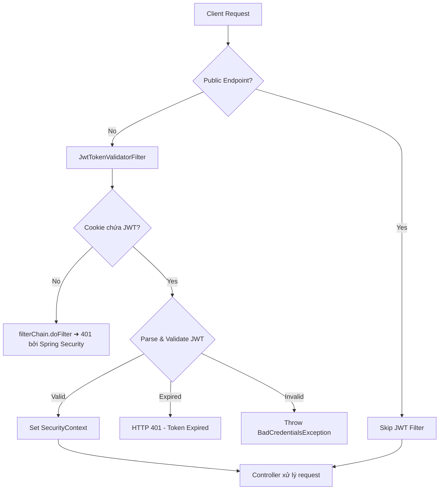
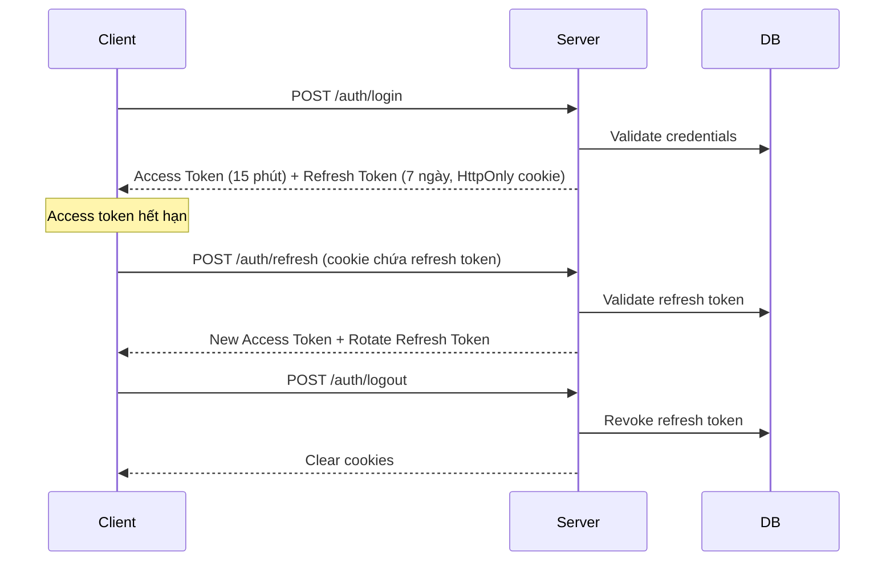

# Phân Tích Security Logic — Dự Án DDD

## Tổng Quan Kiến Trúc Security



### Các file liên quan:

| File | Vai trò |
|------|---------|
| [SecurityConfig.java](file:///home/shrimp/code/ddd/ddd-infrastructure/src/main/java/com/ddd/infrastructure/config/security/SecurityConfig.java) | Cấu hình SecurityFilterChain, CORS, AuthenticationManager |
| [JwtTokenValidatorFilter.java](file:///home/shrimp/code/ddd/ddd-infrastructure/src/main/java/com/ddd/infrastructure/config/security/filter/JwtTokenValidatorFilter.java) | Filter xác thực JWT token từ cookie |
| [JwtUtil.java](file:///home/shrimp/code/ddd/ddd-infrastructure/src/main/java/com/ddd/infrastructure/util/JwtUtil.java) | Tạo, parse, validate JWT |
| [ApplicationConstants.java](file:///home/shrimp/code/ddd/ddd-infrastructure/src/main/java/com/ddd/infrastructure/constant/ApplicationConstants.java) | Hằng số JWT, inject từ config |
| [SecurityConstant.java](file:///home/shrimp/code/ddd/ddd-infrastructure/src/main/java/com/ddd/infrastructure/constant/SecurityConstant.java) | Public endpoints, CORS config |
| [UserDetailsCustom.java](file:///home/shrimp/code/ddd/ddd-infrastructure/src/main/java/com/ddd/infrastructure/config/security/custom/UserDetailsCustom.java) | Custom UserDetails với userId |
| [UserServiceCustom.java](file:///home/shrimp/code/ddd/ddd-infrastructure/src/main/java/com/ddd/infrastructure/config/security/custom/UserServiceCustom.java) | Load user từ DB |
| [AuthServiceImpl.java](file:///home/shrimp/code/ddd/ddd-application/src/main/java/com/ddd/application/service/auth/impl/AuthServiceImpl.java) | Logic login, register, tạo cookie |
| [AuthController.java](file:///home/shrimp/code/ddd/ddd-api/src/main/java/com/ddd/api/controller/AuthController.java) | API endpoints cho auth |
| [GlobalExceptionHandler.java](file:///home/shrimp/code/ddd/ddd-api/src/main/java/com/ddd/api/exception/GlobalExceptionHandler.java) | Xử lý exception tập trung |

---

## ✅ Điểm Hợp Lý

### 1. Kiến trúc phân tầng rõ ràng theo DDD
- **API layer** (`AuthController`) chỉ chứa mapping request/response
- **Application layer** (`AuthServiceImpl`) chứa business logic auth
- **Infrastructure layer** chứa JWT utility, Security config, UserDetails
- Separation of concerns tốt, dễ maintain và test

### 2. JWT Cookie-based authentication thay vì Header-based
- Token được gửi qua **HttpOnly cookie** — tự động gắn vào mọi request, client-side JS không đọc được → chống XSS đọc token
- Cookie có `path="/"` → áp dụng toàn ứng dụng

### 3. CSRF đã disable hợp lý
- Vì dùng JWT (stateless) + REST API, việc tắt CSRF là đúng khi **không dùng session-based auth**
- Tuy nhiên, khi dùng cookie-based JWT, điều này tạo ra 1 lỗ hổng (xem phần chưa hợp lý bên dưới)

### 4. SecurityFilterChain cấu hình gọn gàng
- Tắt `formLogin` và `httpBasic` — phù hợp với API-only backend
- `shouldNotFilter` trên `JwtTokenValidatorFilter` đồng bộ với `PUBLIC_ENDPOINTS` → nhất quán
- Filter đặt **trước** `BasicAuthenticationFilter` → đúng vị trí trong filter chain

### 5. BCrypt với strength = 10
- Đủ mạnh cho production, cân bằng giữa bảo mật và performance

### 6. CORS cấu hình có kiểm soát
- Chỉ cho phép `localhost` origins
- Có `maxAge = 3600L` để cache preflight
- `allowCredentials = true` → cần thiết cho cookie-based auth

### 7. Exception handling cho security errors
- `BadCredentialsException`, `AccessDeniedException`, `UnauthorizedException` đều được xử lý riêng với mã lỗi chuẩn
- Catch-all `Exception` handler đảm bảo không leak stack trace ra client

### 8. Centralized public endpoints
- `SecurityConstant.PUBLIC_ENDPOINTS` dùng chung giữa `SecurityConfig` và `JwtTokenValidatorFilter` → single source of truth

---

## ❌ Điểm Chưa Hợp Lý

### 🔴 Mức độ CRITICAL

#### 1. JWT Secret hardcoded trong source code
> [!CAUTION]
> **File**: [ApplicationConstants.java:20](file:///home/shrimp/code/ddd/ddd-infrastructure/src/main/java/com/ddd/infrastructure/constant/ApplicationConstants.java#L20), [application.yml:32](file:///home/shrimp/code/ddd/ddd-infrastructure/src/main/resources/application.yml#L32), [.env:34](file:///home/shrimp/code/ddd/.env#L34)

```java
// Cùng 1 secret key xuất hiện 3 nơi — và là default fallback!
public static String JWT_SECRET = "jxgEQeXHuPq8VdbyYFNkANdudQ53YUn4";
```

**Vấn đề:**
- Secret lộ trong Git history vĩnh viễn (dù sau này đổi)
- 32 ký tự ASCII = 256 bits → **vừa đủ** cho HMAC-SHA256 nhưng không có margin
- Cùng 1 giá trị default ở 3 chỗ → dễ quên đổi khi deploy

---

#### 2. Cookie thiếu `secure=true` — lộ token trên HTTP
> [!CAUTION]
> **File**: [AuthServiceImpl.java:80](file:///home/shrimp/code/ddd/ddd-application/src/main/java/com/ddd/application/service/auth/impl/AuthServiceImpl.java#L80)

```java
ResponseCookie.from(jwtUtil.getCookieName(), jwtToken)
    .httpOnly(true)
    .secure(false)     // ← Cookie gửi qua HTTP plaintext!
    .path("/")
    .maxAge(jwtUtil.getExpirationMs() / 1000)
    .build();
```

**Vấn đề:**
- Token gửi qua HTTP không mã hóa → attacker trên cùng mạng WiFi có thể sniff
- Thiếu `SameSite` attribute → browser sẽ dùng default (`Lax`), nhưng nên set explicit

---

#### 3. CSRF tắt + Cookie-based JWT = **lỗ hổng CSRF**
> [!CAUTION]
> Đây là lỗ hổng kiến trúc quan trọng nhất.

Khi JWT nằm trong cookie, browser **tự động gắn** cookie vào mọi request đến server. Nếu CSRF protection bị tắt, một trang web độc hại có thể:
```html
<!-- Trang attacker.com -->
<form action="https://your-api.com/api/transfer" method="POST">
    <input name="amount" value="1000000" />
    <input type="submit" />
</form>
```
Browser sẽ tự gắn cookie JWT → request hợp lệ!

---

#### 4. JWT Token trả về cả trong response body lẫn cookie
> [!WARNING]
> **File**: [LoginResponseDto.java:8](file:///home/shrimp/code/ddd/ddd-api/src/main/java/com/ddd/api/dto/auth/res/LoginResponseDto.java#L8), [AuthController.java:28-31](file:///home/shrimp/code/ddd/ddd-api/src/main/java/com/ddd/api/controller/AuthController.java#L28-L31)

```java
// Cookie (HttpOnly, tốt)
.header(HttpHeaders.SET_COOKIE, authService.getUserCookie(loginDto.jwtToken()).toString())
// Response body (lộ token cho JS đọc, xấu)
.body(BaseResponse.of(authMapper.toLoginResponse(loginDto)));
// LoginResponseDto chứa field jwtToken!
```

**Vấn đề:** Mục đích dùng HttpOnly cookie là để JS không đọc được token. Nhưng lại trả token trong response body → vô hiệu hóa lợi ích HttpOnly.

---

### 🟡 Mức độ WARNING

#### 5. Không có Refresh Token — UX kém và bảo mật yếu
**Vấn đề:**
- Access token sống 24 giờ (`86400000ms`) → quá dài, nếu bị đánh cắp thì attacker có 24h để khai thác
- Không có cơ chế refresh → user phải login lại sau 24h
- Không thể revoke token (stateless JWT) → user đổi password vẫn bị kẻ cũ truy cập

#### 6. Không có logout endpoint
- Không có API để xóa cookie JWT
- User không thể chủ động "đăng xuất"
- Dù xóa cookie ở client, token vẫn valid cho đến khi hết hạn

#### 7. `UserServiceCustom.loadUserByUsername` không xử lý user không tồn tại
> [!WARNING]
> **File**: [UserServiceCustom.java:26](file:///home/shrimp/code/ddd/ddd-infrastructure/src/main/java/com/ddd/infrastructure/config/security/custom/UserServiceCustom.java#L26)

```java
User user = userRepository.findByUsername(username);
String roleName = user.getRole().toUpperCase(); // ← NullPointerException nếu user = null!
```

Nếu `findByUsername` trả `null`, code sẽ throw `NullPointerException` thay vì `UsernameNotFoundException` → Spring Security không xử lý được đúng flow.

#### 8. `AuthServiceImpl.login` query DB 2 lần
> [!WARNING]
> **File**: [AuthServiceImpl.java:36-43](file:///home/shrimp/code/ddd/ddd-application/src/main/java/com/ddd/application/service/auth/impl/AuthServiceImpl.java#L36-L43)

```java
// Lần 1: AuthenticationManager gọi UserServiceCustom.loadUserByUsername
var resultAuthentication = authenticationManager.authenticate(...);
// Lần 2: Lại gọi findByUsername!
user = userRepository.findByUsername(fetchedUser.getUsername());
```

`UserDetailsCustom` đã chứa `userId`, `username`, `authorities` — đủ để tạo `LoginDto` mà không cần query lại.

#### 9. Claim key không nhất quán: `userId` vs `UserId`
> [!WARNING]
> **Files**: [JwtUtil.java:93](file:///home/shrimp/code/ddd/ddd-infrastructure/src/main/java/com/ddd/infrastructure/util/JwtUtil.java#L93) vs [JwtUtil.java:107](file:///home/shrimp/code/ddd/ddd-infrastructure/src/main/java/com/ddd/infrastructure/util/JwtUtil.java#L107)

```java
// Khi generate: claim key = "userId" (camelCase)
.claim("userId", fetchedUser.getUserId())

// Khi extract: claim key = "UserId" (PascalCase)  
public Long getUserIdFromToken(String token) {
    return parseClaims(token).get("UserId", Long.class); // ← Sẽ trả null!
}
```

`getUserIdFromToken()` sẽ luôn trả `null` vì key không khớp.

#### 10. `ApplicationConstants` — Anti-pattern với static mutable fields
> [!WARNING]
> **File**: [ApplicationConstants.java](file:///home/shrimp/code/ddd/ddd-infrastructure/src/main/java/com/ddd/infrastructure/constant/ApplicationConstants.java)

```java
public static String JWT_SECRET = "jxgEQeXHuPq8VdbyYFNkANdudQ53YUn4";

@Value("${jwt.secret:...}")
public void setJwtSecret(String jwtSecret) {
    JWT_SECRET = jwtSecret;  // ← inject instance method gán vào static field
}
```

**Vấn đề:**
- Static mutable state → **không thread-safe**, race condition khi Spring inject
- Logic fallback phức tạp: `JwtUtil.getSecretKey()` kiểm tra static field rồi lại kiểm tra `Environment` → dư thừa vì `@Value` đã resolve rồi
- Không testable — khó mock trong unit test

#### 11. Thiếu `AuthenticationEntryPoint` custom
- Khi request không có JWT tới protected endpoint, Spring Security trả default 403 thay vì 401
- Không có response body chuẩn JSON → client nhận HTML error page

#### 12. `userId` claim cast `Long` trong filter có thể fail
> [!WARNING]
> **File**: [JwtTokenValidatorFilter.java:44](file:///home/shrimp/code/ddd/ddd-infrastructure/src/main/java/com/ddd/infrastructure/config/security/filter/JwtTokenValidatorFilter.java#L44)

```java
Long userId = (Long) claims.get("userId"); // ← JWT parse Integer → ClassCastException
```

JWT library thường parse number thành `Integer` nếu giá trị nhỏ → cần dùng `.get("userId", Long.class)` hoặc `Number.longValue()`.

#### 13. Chỉ hỗ trợ **1 role duy nhất** per user

[UserServiceCustom.java:28](file:///home/shrimp/code/ddd/ddd-infrastructure/src/main/java/com/ddd/infrastructure/config/security/custom/UserServiceCustom.java#L28):
```java
String roleName = user.getRole().toUpperCase();  // ← single role
```

Mô hình `User.getRole()` trả String đơn — không hỗ trợ multiple roles. Cân nhắc nếu tương lai cần RBAC phức tạp.

---

## 💡 Gợi Ý Triển Khai Tốt Hơn

### 1. Tách JWT config thành `@ConfigurationProperties` bean

Thay `ApplicationConstants` bằng immutable, type-safe config:

```java
@ConfigurationProperties(prefix = "jwt")
public record JwtProperties(
    String secret,
    long expirationMs,
    String cookieName,
    String header
) {
    public JwtProperties {
        // Validation khi khởi tạo
        if (secret == null || secret.length() < 32) {
            throw new IllegalArgumentException(
                "JWT secret must be at least 32 characters");
        }
    }
}
```

**Lợi ích:** Không còn static mutable state, thread-safe, testable, fail-fast khi thiếu config.

---

### 2. Bảo vệ CSRF khi dùng Cookie-based JWT

**Phương án A — Double-Submit Cookie (Khuyến nghị):**
```java
// Khi login, tạo thêm 1 CSRF token
String csrfToken = UUID.randomUUID().toString();
// Gửi CSRF token trong NON-HttpOnly cookie (JS đọc được)
ResponseCookie csrfCookie = ResponseCookie.from("XSRF-TOKEN", csrfToken)
    .httpOnly(false).secure(true).path("/").build();
// Client gửi lại qua header X-XSRF-TOKEN
// Server so sánh cookie value vs header value
```

**Phương án B — Chuyển JWT sang header Authorization:**
- Lưu token trong memory (JS variable), không dùng cookie
- Tự gắn `Authorization: Bearer <token>` header
- Miễn nhiễm CSRF nhưng cần cẩn thận XSS

---

### 3. Implement Refresh Token flow



**Key points:**
- Access token: **15 phút** (short-lived, stateless)
- Refresh token: **7 ngày** (stored in DB, revocable)
- **Token rotation**: mỗi lần refresh → cấp refresh token mới, invalidate token cũ
- Logout = xóa refresh token trong DB

---

### 4. Fix Cookie security

```java
public ResponseCookie getUserCookie(String jwtToken) {
    return ResponseCookie.from(jwtUtil.getCookieName(), jwtToken)
        .httpOnly(true)
        .secure(true)               // ← Chỉ gửi qua HTTPS
        .sameSite("Strict")         // ← Chống CSRF
        .path("/")
        .maxAge(jwtUtil.getExpirationMs() / 1000)
        .build();
}
```

> [!TIP]
> Trong development, có thể dùng profile-based config: `secure=false` cho `dev`, `secure=true` cho `prod`.

---

### 5. Thêm `AuthenticationEntryPoint` & `AccessDeniedHandler`

```java
@Component
public class JwtAuthenticationEntryPoint implements AuthenticationEntryPoint {
    @Override
    public void commence(HttpServletRequest request, HttpServletResponse response,
                         AuthenticationException exception) throws IOException {
        response.setContentType("application/json");
        response.setStatus(HttpServletResponse.SC_UNAUTHORIZED);
        response.getWriter().write(
            "{\"code\":\"UNAUTHORIZED\",\"message\":\"Authentication required\"}");
    }
}
```

Và đăng ký trong `SecurityConfig`:
```java
.exceptionHandling(ex -> ex
    .authenticationEntryPoint(jwtAuthEntryPoint)
    .accessDeniedHandler(customAccessDeniedHandler))
```

---

### 6. Fix `UserServiceCustom` — handle null user

```java
@Override
public UserDetailsCustom loadUserByUsername(String username) 
        throws UsernameNotFoundException {
    User user = userRepository.findByUsername(username);
    if (user == null) {
        throw new UsernameNotFoundException(
            "User not found: " + username);
    }
    // ... tiếp tục xử lý
}
```

---

### 7. Không trả JWT token trong response body

```diff
- public record LoginResponseDto(Long userId, String name, String username,
-                                String email, String role, String jwtToken) {}
+ public record LoginResponseDto(Long userId, String name, String username,
+                                String email, String role) {}
```

Token chỉ nên nằm trong HttpOnly cookie — client không cần đọc nó.

---

### 8. Fix `userId` type casting trong filter

```java
// Thay:
Long userId = (Long) claims.get("userId");

// Bằng:
Long userId = claims.get("userId", Long.class);
```

---

## 📊 Bảng Tổng Kết

| # | Vấn đề | Mức độ | Effort |
|---|--------|--------|--------|
| 1 | JWT Secret hardcoded | 🔴 Critical | Thấp |
| 2 | Cookie `secure=false` | 🔴 Critical | Thấp |
| 3 | CSRF bị tắt + cookie auth | 🔴 Critical | Trung bình |
| 4 | Token lộ trong response body | 🔴 Critical | Thấp |
| 5 | Không có refresh token | 🟡 Warning | Cao |
| 6 | Không có logout | 🟡 Warning | Trung bình |
| 7 | NPE trong loadUserByUsername | 🟡 Warning | Thấp |
| 8 | Query DB 2 lần khi login | 🟡 Warning | Thấp |
| 9 | Claim key `userId`/`UserId` | 🟡 Warning | Thấp |
| 10 | Static mutable constants | 🟡 Warning | Trung bình |
| 11 | Thiếu AuthenticationEntryPoint | 🟡 Warning | Thấp |
| 12 | Cast Long có thể fail | 🟡 Warning | Thấp |
| 13 | Single role only | 🔵 Info | Cao |

---

## 🎯 Thứ Tự Ưu Tiên Triển Khai

1. **Ngay lập tức**: Fix #7 (NPE), #9 (claim key), #12 (cast) — Low effort, high impact bugs
2. **Sớm**: Fix #2 (secure cookie), #4 (remove token from body), #11 (entry point)
3. **Quan trọng**: Fix #1 (externalize secret), #10 (ConfigurationProperties)
4. **Kiến trúc**: Implement #3 (CSRF protection) hoặc chuyển sang header-based JWT
5. **Tính năng**: Implement #5 (refresh token), #6 (logout)
